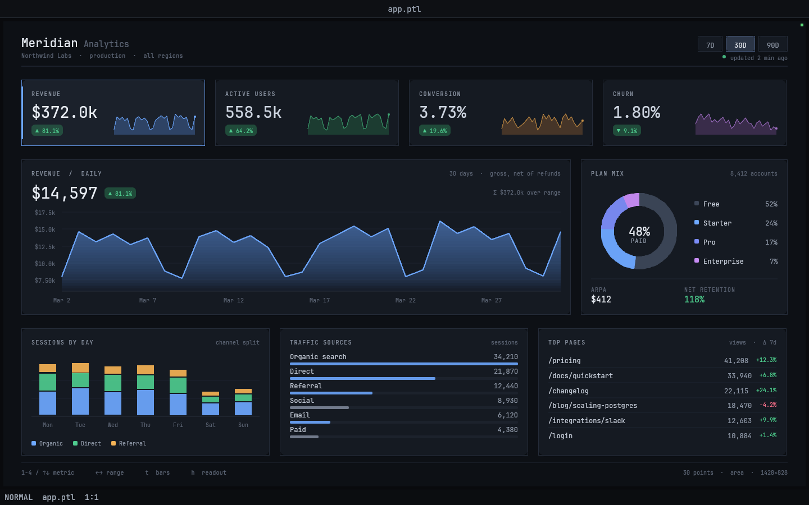

# 41 — Meridian, an analytics dashboard

A product-analytics dashboard for a fictional SaaS ("Meridian / Northwind Labs"),
drawn entirely by a Petal panel script. It is the cards-charts-grid entry of the
testbed: four KPI cards with sparklines, an animated main chart with a hover
readout, a donut, a stacked column chart, a ranked bar list and a table — all on
a card grid that reflows with the pane width.



## Viewport

Designed for **1440 × 900** (`GARDEN_HEADLESS_SIZE=1440x900`), which gives the
panel a 1428 × 828 pane. The layout solves its own vertical division from the
pane height, so it also fills 1180 × 900 and 1600 × 1000 cleanly. Below roughly
1000 px wide the grid folds (KPI 4-up → 2-up, donut moves down into the bottom
grid) and the page then wants about 1100 px of height; narrower-and-shorter
panes clip the last row.

## Run it

The quickest way is `./launch.sh` in this directory (it finds the `garden`
binary and sets the viewport; extra arguments are passed through, e.g.
`./launch.sh --headless --debug-port 0`). By hand:

```bash
cd examples/dashboards/analytics-dashboard
GARDEN_HEADLESS_SIZE=1440x900 \
  /Users/andy/petal/garden/target/debug/garden \
  --headless --debug-port 0 --init layout.ptl > log.txt 2>&1 &
PORT=$(grep -o '127.0.0.1:[0-9]*' log.txt | cut -d: -f2)
curl -s localhost:$PORT/screenshot -o shot.png
# ... and when you are done, kill it by PID (never pkill):
kill $(lsof -nP -iTCP:$PORT -sTCP:LISTEN -t)
```

## Controls

| Input | Effect |
|---|---|
| `1` `2` `3` `4` | select Revenue / Active users / Conversion / Churn |
| `↑` `↓` | cycle the selected metric |
| `←` `→` | change the range: 7D · 30D · 90D |
| click a KPI card | select that metric |
| click a range pill | change the range |
| `t` | main chart: area ⇄ bars |
| `h` | show / hide the hover readout |
| hover the main chart | crosshair, marker and a date+value tooltip |
| hover the donut | the segment lifts, the legend row highlights, the centre label switches to that plan |
| hover a weekday column | the column lights up and its total is labelled |
| hover a source / page row | row highlight |

Selecting a different metric or range morphs the chart: the previous normalised
shape is tweened into the new one over ~0.3 s, and the "over range" aggregate
counts toward its new value. Like every Garden panel, this stops when the panel
sleeps 10 s after the last input — inject any event to wake it.

## What it exercises

**Language.** Records and record lists as the data model; `state` for everything
that persists across frames (the seeded series, the selection, the tween);
`let`-dataflow everywhere else; for-loops in value position as the mapping
primitive (`make_series`, `resample`, `grid_cells`); function overloading through
the `ui` prelude's record `draw_*` forms; string interpolation; integer vs float
arithmetic discipline (the layout is integral, the chart maths is not).

**Host / draw surface.** `clear`, `draw_rect`, `draw_rect_rounded`,
`draw_rect_outline`, `draw_line`, `draw_circle`, `fill_poly`, styled `draw_text`
with `spacing`, `text_width` for exact right/centre alignment, and `clip` —
which is what makes the chart's vertical gradient possible: the area is a fan of
convex trapezoids redrawn inside a stack of pixel-snapped clip bands with a
falling alpha. The donut is built the same way, one convex quad per ring segment.

**Prelude.** `rect`, `hovered`, `point_in`, `clicked`, `ellipsize`, `iclamp`-style
geometry, and the `Rect` class methods.

**Input.** `key_pressed`, `mouse_pressed`, `mouse_x/y`, `dt()` for
frame-rate-independent easing.

## Files

- `app.ptl` — the whole app
- `layout.ptl` — `layout(panel("app.ptl"))`
- `final.png` — reference render at 1440 × 900
