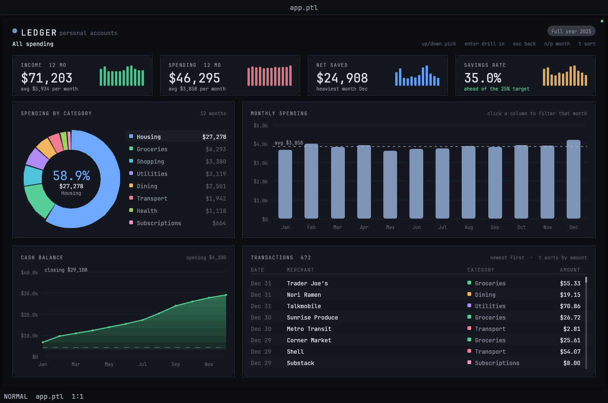

# 43 — Ledger, a personal finance dashboard

A Garden panel app: a year of personal accounts drawn as four KPI tiles, a
donut of spending by category, a twelve-month column chart, a cumulative line
chart and a transaction table — **all six regions scoped to the same drill
path**. Descending from *all spending* into a category and then into a single
merchant re-derives every chart, every KPI and every row from the new scope; a
month filter cuts across that path as a second, independent dimension.



The ledger itself (672 transactions across 8 categories and 32 merchants, plus
twelve months of income) is generated at startup from a seeded hash, so the
numbers are identical on every launch and survive hot reload.

## Viewport

Designed for the **default headless viewport, 1280×850** — which gives the
panel pane 1268×778 logical pixels after Garden's tab strip and status bar. No
`GARDEN_HEADLESS_SIZE` needed. The layout is a fixed two-column grid anchored
to `screen_width()` / `screen_height()`, so a wider pane widens the right
column and a taller one lengthens the table; it is tuned for the size above.

## Run

The quickest way is `./launch.sh` in this directory (it finds the `garden`
binary and sets the viewport; extra arguments are passed through, e.g.
`./launch.sh --headless --debug-port 0`). By hand:

```bash
cd examples/dashboards/finance-dashboard
garden --headless --debug-port 0 --init layout.ptl
```

(`garden` = `garden/target/debug/garden`. Drop `--headless --debug-port 0` to
run it in a window.)

## Controls

| Input | Effect |
|---|---|
| hover a donut slice | lifts it, dims the rest, and swaps the ring's centre readout to that slice |
| **click** a donut slice or a legend row | drill in — all spending → category → merchant |
| **click** a transaction row | drill straight to that row's merchant |
| **click** a breadcrumb segment | jump back to that level |
| `up` / `down` (or `k` / `j`) | move the slice selection |
| `enter` / `right` | drill into the selected slice |
| `esc` / `backspace` / `left` | climb one level out |
| hover a column | highlights it and prints the month's total above the bar |
| **click** a column | filter to that month (click again to clear) |
| `n` / `p` | step the month filter forward / back through `Jan … Dec … full year` |
| `a` | clear the month filter |
| `t` | re-sort the table between newest-first and largest-first |
| wheel over the table | scroll |

The month filter deliberately does **not** collapse the column and line charts
— they keep showing all twelve months, with the filtered one picked out in
accent — while the donut, the table and the transaction count follow it.

## What it exercises

**Language.** Records and nested record literals for the chart of accounts;
`for`-as-expression for every derived series; `state` for the persistent
ledger, the drill path and the animation clock; closures over top-level
constants; string interpolation for the cache key; integer/float discipline
(all layout maths is float, all money formatting goes through hand-rolled
`commas` / `dec` because there is no printf).

Two techniques worth calling out:

- **Sorting without a comparator.** `sort` takes no key function, so rows and
  slices are ranked by packing `(rank, index)` into a single int
  (`rank * 4096 + i`), sorting *that*, and unpacking — O(n log n) instead of
  the quadratic list-copying an insertion sort in Petal would cost over 672
  rows.
- **A one-entry view cache.** Every scope change rebuilds the aggregate once
  and stores it in `state` under a string key, so a 672-row filter/aggregate/
  sort runs on the frame the drill happens and never again.

**Host.** The full draw surface: `fill_poly` fans for the donut wedges (there
is no arc primitive), `draw_rect_rounded` with alpha for cards and columns,
clip-strip gradient bands under the line chart, `draw_circle`, `draw_line`
with a stroke width, and `draw_text` with a style record (`size`, `color`,
`spacing`). `text_width` on the same style record is what makes the
right-aligned money columns, the centred axis labels and the ellipsised KPI
headings land exactly. Hit testing is all pure Petal: `atan2` polar hit
testing for the donut, rect tests via the prelude's `hovered`, and the
prelude's `scroll_update` / `draw_scrollbar` for the table.

Interesting names are readable in the debug server's `panel.values` —
`level`, `sel_cat`, `sel_mer`, `month`, `legend_sel`, `sort_mode`,
`table_scroll`, `hot_slice`, `hot_col`, `hot_row`, `scope_name` and a `drills`
counter that makes a drill observable across a later `GET /state`. The ledger
and the derived view are `_`-prefixed so they stay out of that dump.

## Note on animation

The donut sweep, the column grow and the line reveal are driven by `dt()` and
finish in about a third of a second after each drill. Garden sleeps a panel
ten seconds after the last input, which is fine here — nothing animates at
rest — but if you are watching a transition headlessly, inject the input and
capture immediately (`/screenshot` settles the frame for you).
