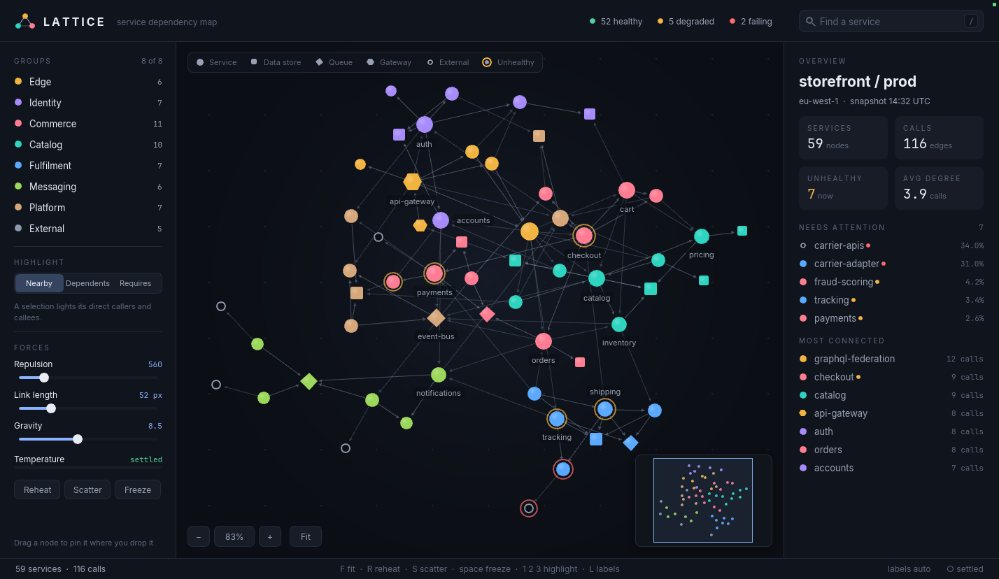
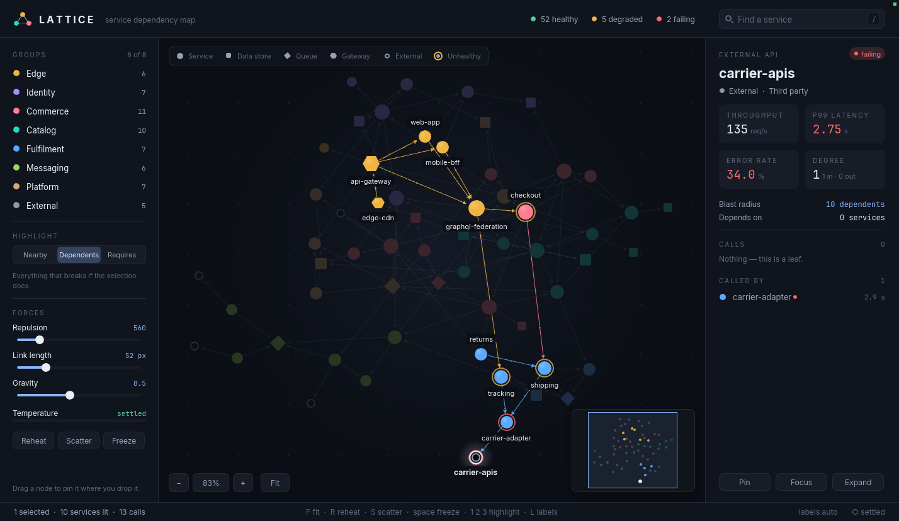

# 45 — Network graph explorer (Lattice)

A Garden panel app: the service dependency map of a fictional storefront —
59 services, 116 calls between them — laid out by a force simulation that runs
inside the script. Every node repels every other, every call is a spring, a
weak gravity keeps the graph on the table, and the layout cools until it
stops. The camera zooms about the pointer and pans by drag; selecting a
service lights up its neighbours, its blast radius, or everything it depends
on, and two selected services show the shortest route between them.



The data tells a small story. `carrier-apis`, a third-party API, is failing;
select it and switch the highlight to **Dependents** to see the ten services
that go down with it:



## What it is

- **Canvas** — the graph. Each kind of node has its own silhouette (service
  disc, data-store square, queue diamond, gateway hexagon, hollow ring for a
  third-party API), each group its own colour, and node size follows degree.
  Calls are arrows from caller to callee, weighted by throughput. Unhealthy
  services wear a breathing halo. Labels are placed greedily, most connected
  first, each trying four positions and skipping any that would cover another
  label or node; how many appear depends on the zoom.
- **Sidebar** — the eight groups (click to hide one, hover to light it), the
  highlight mode, three force sliders, a temperature meter for the layout, and
  Reheat / Scatter / Freeze.
- **Inspector** — for one service: status, owner, throughput, p99, error rate,
  degree, blast radius, and clickable lists of what it calls and what calls
  it. For two: the shortest path. For several: combined figures and the
  members. With nothing selected: an overview, the unhealthy services worst
  first, and the hubs.
- **Search** — `/` focuses it; matches light up on the canvas and drop down
  under the field.
- **Minimap** and zoom pills float over the canvas corners.

## Run it

The quickest way is `./launch.sh` in this directory (it finds the `garden`
binary and sets the viewport; extra arguments are passed through, e.g.
`./launch.sh --headless --debug-port 0`). By hand:

```bash
cd examples/dashboards/network-graph
GARDEN_HEADLESS_SIZE=1440x900 \
  ../../../garden/target/debug/garden --headless --debug-port 0 --init layout.ptl
```

Designed for a **1440×900** viewport, which gives the panel pane 1428×828.
The sidebar (252 px) and inspector (308 px) are fixed; the canvas takes the
rest and the camera fits the graph to it, so other sizes work at a different
zoom. Nothing is persisted — every launch starts from the same seeded layout,
so no `GARDEN_PANEL_STORE_DIR` is needed.

The layout opens already relaxed (140 simulation steps run before the first
frame) and finishes cooling live. While it is cooling the status bar reads
`● simulating` and the panel asks for frames; once it reads `○ settled` only
the halos on unhealthy services and the packets on a selection's calls keep
moving. Press `M` to stop those too, after which the panel sleeps ten seconds
after the last input like any other — a still graph is a settled one, not a
hang. Under the headless harness, `POST /tick` steps the simulation by exactly
one frame per tick.

## Controls

### Mouse, on the canvas

| Input | Effect |
|---|---|
| **Wheel** | Zoom about the pointer (25%–350%). Wheel up zooms in. |
| **Drag empty canvas** | Pan. Middle-drag pans from anywhere. |
| **Click a node** | Select it. Click empty canvas to clear. |
| **Shift-click a node** | Add it to, or remove it from, the selection. |
| **Shift-drag empty canvas** | Box-select every node inside. |
| **Drag a node** | Move it (and the rest of the selection) and pin it where it is dropped; the layout reheats around it. |
| **Double-click a node** | Select it and glide the camera to it at 170%. |
| **Hover a node** | Preview its neighbourhood and show a card with its figures. |
| **Right-click a node** | Pin / Unpin · Focus camera · Select neighbours · Select group · Hide group. |
| **Right-click the canvas** | Fit to view · Reheat layout · Scatter · Unpin all · Show all groups. |
| **Minimap** | Click or drag to put the view there. |
| **− · % · + · Fit** | Zoom out, back to 100%, zoom in, fit the graph. |

### Keys

| Key | Effect |
|---|---|
| `/` | Focus the search field. Type to filter, `↑` `↓` to choose, `return` to select and go, `esc` to clear. |
| `←` `→` `↑` `↓` | Walk the selection to the nearest node in that direction. |
| `1` `2` `3` | Highlight: nearby (one hop) · dependents (everything upstream) · requires (everything downstream). |
| `E` | Grow the selection by one hop. |
| `C` | Frame the selection. |
| `F` · `0` · `+` · `−` | Fit the graph · 100% · zoom in · zoom out. |
| `P` · `U` | Pin or unpin the selection · unpin everything. |
| `R` · `S` · `space` | Reheat the layout · scatter every node and let it re-form · freeze or resume. |
| `L` | Labels: auto → all → off. |
| `M` | Ambient motion (halos, packets) on or off. |
| `⌘A` | Select everything visible. |
| `esc` | Cancel a drag, else clear the selection, else clear the search. |

### Sidebar and inspector

| Control | Effect |
|---|---|
| **Group row** | Click hides or shows the group (the layout re-forms without it); hover lights it on the canvas. |
| **Nearby · Dependents · Requires** | The highlight mode, as `1` `2` `3`. |
| **Repulsion · Link length · Gravity** | Force parameters. Any change reheats the layout. |
| **Reheat · Scatter · Freeze** | As `R`, `S`, `space`. |
| **A row naming a service** | Click selects it and brings it into view; hover rings it on the canvas. |
| **Pin · Focus · Expand** (one selected) | Pin it · camera to it · grow the selection by a hop. |
| **Pin · Frame · Clear** (several) | Pin them all · fit the camera to them · deselect. |

## What it exercises

**Force-directed layout.** `sim_step` is a pure function from four lists
(positions and velocities) to four new ones: O(n²) repulsion with a stiff
shove when discs overlap, a spring per call whose rest length is shorter
inside a group than across groups (which is what makes the clusters) and
whose strength falls off on hubs, gravity that is stronger vertically so the
graph takes the landscape shape of the canvas, then d3-style integration —
force × temperature into velocity, velocity decay, clamp. Temperature decays
by 1.4% a step and the simulation stops below 2%. Dragging a node, moving a
slider, hiding a group or pinning all reheat it. The step count per frame
comes from `dt()` (clamped to three), so a 200 ms headless frame and a 16 ms
windowed one cool at about the same wall-clock rate.

**Zoom and pan.** A `{x, y, z}` camera with `zoom_about` keeping the world
point under the pointer fixed; an eased camera target for fit / focus / frame
that any manual move cancels; an auto-fit that follows the layout while it is
still finding its shape and lets go the moment the user takes the camera; a
minimap that maps the same camera back onto the graph's bounds. Node discs
scale with `zoom^0.55`, so zooming in opens the graph up instead of only
magnifying it, and hit-testing uses the same scaled radius.

**Selection.** Click, shift-click, box select, select-all, keyboard walking,
grow-by-a-hop, select-group; selection drives three breadth-first highlights
and a shortest-path search; hover previews; selection survives hiding other
groups and drops members of a hidden one.

**Language**

- `state` for what persists (positions, velocities, pins, temperature,
  selection, camera, drag gesture, search text); plain `let` for every
  per-frame derivation; no `var` anywhere — BFS and shortest path thread their
  queues through `while` loops with ordinary rebinds, and the simulation
  builds its output lists with `append`.
- The graph (edges resolved from `"caller>callee"` strings, adjacency in three
  directions, degrees, spring table, draw order) is built once into a `state`
  and passed to the functions that need it.
- Collecting `for` with `continue` as a filter; index writes through a list
  held in `state` (`px[i] = …`, `pins[i] = …`) for the dragged nodes; `match`
  for the kind labels; `elsif` chains as value expressions.
- A hand-rolled LCG for the scatter so every layout is reproducible without a
  seed from the host.

**Host / petal-ui**

- Draw surface: `fill_polygon` / `draw_polygon_outline` for hexagons and
  diamonds, `draw_circle_gradient` for glows, the sheen on each disc and the
  pool of light under the graph, `draw_line` with fractional widths and
  `fill_triangle` arrowheads, `draw_rect_gradient_rounded` for the
  temperature bar, `draw_shadow`, `clip` / `clip_push` for the canvas and the
  minimap.
- Prelude: `slider`, `text_field_update` (the logic half, with the field
  drawn by the app), the `focus_*` registry, `menu_show` / `menu_blocking` /
  `context_menu`, `over` for opaque tints, `wrap_px`, `ellipsize`,
  `hovered` / `point_in`.
- Input: buttons 0, 1 and 2, `click_count()`, `scroll_y()`, the modifier
  reads, `claim_key("a", "cmd")`, `request_frame()` while anything moves.

**Debug server** — every logical value is a plain binding in
`GET /state → panes[0].panel.values`:

| Value | Meaning |
|---|---|
| `obs_nodes` | every visible node as `{n, x, y, r}` in pane-local pixels — add `panes[0].rect` to click one |
| `obs_sel`, `obs_path`, `obs_hover` | selected names, the shortest path between two, the node under the pointer |
| `obs_mode`, `obs_lit`, `obs_lit_edges` | highlight mode and how much it lights |
| `obs_zoom`, `obs_cam` | the camera |
| `obs_alpha`, `obs_hot`, `obs_frozen`, `obs_steps`, `obs_speed` | temperature, whether the simulation ran this frame, total steps, summed node speed |
| `obs_pins`, `obs_hidden`, `obs_force`, `obs_shuffle` | pinned count, hidden groups, `[repulsion, link length, gravity]`, scatter count |
| `obs_query`, `obs_typing`, `obs_matches` | the search field |
| `obs_labels`, `obs_label_mode`, `obs_drag`, `obs_clicks` | labels drawn, label mode, the gesture in progress, canvas presses |

A deterministic run is `POST /panel/reset {}` then `POST /tick
{"n":220,"dt":0.016}`: the layout is settled, and `obs_zoom` came out 0.8322
and `obs_steps` 311 on each of the runs made while building it. The app was
verified with a 72-check script driving the controls above and asserting on
these values, with `status_error` null throughout. Two things in the tables
could not be driven from the debug server and are untested: middle-drag pan
(`POST /mouse` has no button 2) and anything in a real window.

## Known limits

- **Named arguments to builtins fail on the checked-in Garden binary.** The
  binary at `garden/target/debug/garden` was built from `f02edf9` and the
  checkout is ahead of it; `clamp(v, lo: 0, hi: 1)` passes
  `petal check --strict --host garden` and then fails in the panel with
  `builtin 'clamp' does not accept named arguments`. The script passes
  builtin arguments by position, which works on both.
- **A `let` bound to a collecting `for` is missing from `panel.values`** on
  that binary: `let obs_sel = for i in sel do NODES[i].n end` never appears,
  while the same list returned from a function, or built with `map`, does.
  The observables are built that way for this reason.
- **Wheel direction is by sign, not by device.** Zoom-in is a negative
  `scroll_y()` — `POST /mouse {"op":"scroll","lines":-3}`. Whether that is
  the comfortable direction on a trackpad with natural scrolling was not
  checked in a window, and there is no host read for that setting.
- **Overlays have to announce themselves early.** The zoom pills, legend and
  search dropdown are drawn after the canvas but must swallow presses before
  the canvas sees them, so their rects are computed at the top of the frame
  and tested by hand (`over_chrome`, `over_drop`). Hover feedback from the
  sidebar and inspector onto the canvas (`group_hover`, `link_hover`) is one
  frame late for the same reason — those panels draw after the canvas.
- **`slider` cannot be skipped to disable it** — it draws as well as reads
  input, so a slider that should ignore the pointer (a menu is open, a drag
  is in progress) is still called and its result discarded.
- **Simulation cost.** Repulsion is the plain O(n²) sum. At 59 nodes a
  simulating frame takes about 12 ms and a settled one about 7 ms on the
  debug build; a few hundred nodes would need a grid or a Barnes–Hut tree.
  The 140 warm-up steps make the first frame take about two seconds there.
- **No edge bundling or curved edges**; two services that call each other
  would draw as one line with two arrowheads (the seeded graph has none).
- Text cannot be rotated, so edge labels (call rates) are left to the
  inspector.
- Nothing is saved: pins, camera and hidden groups reset on relaunch.
