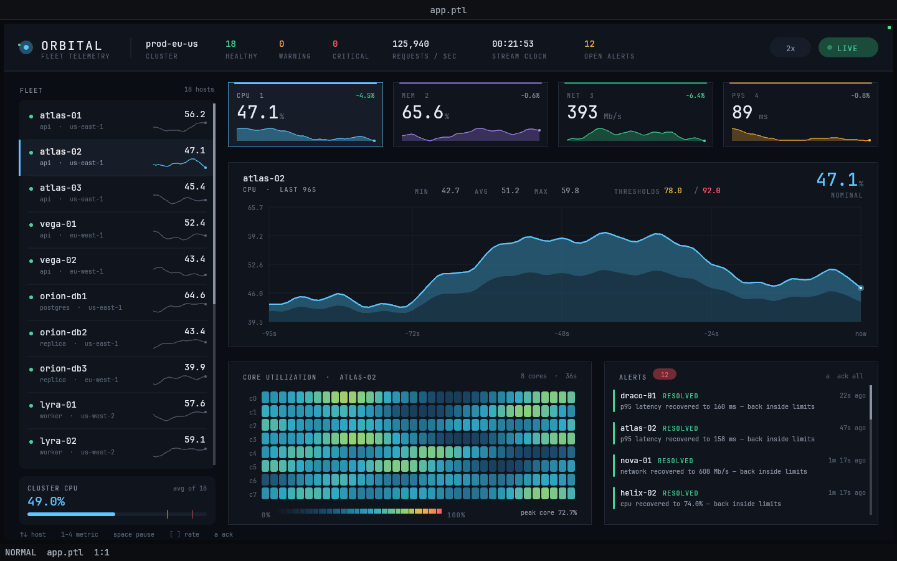

# 42 — ORBITAL, a live server-monitoring dashboard

A Garden panel app: an 18-host fleet console with a streaming metric feed,
sparklines everywhere, a per-core utilization heatmap and a threshold-driven
alert log.



## What it is

Five regions, all reading the same simulated stream:

- **Header** — cluster identity, healthy/warning/critical host counts, derived
  request throughput, the stream clock, the open-alert count, a stream-rate
  pill and a LIVE/PAUSED pill (both clickable).
- **Fleet column** — 18 hosts with a status dot, role/region, the selected
  metric's current reading and a 20-sample sparkline. Scrollable, selectable,
  with a cluster-average footer carrying the warning/critical marks on its bar.
- **KPI tiles** — CPU, memory, network and p95 latency for the selected host:
  current value, 20-sample delta, and a 44-sample filled sparkline. Click one
  (or press its number) to make it the chart's metric.
- **Streaming chart** — a 96-second rolling window with a self-scaling axis,
  dashed warning/critical thresholds, a two-pass gradient area fill, a live head
  marker and a hover crosshair with a value/age readout.
- **Core heatmap** — 8 cores × 36 seconds of per-core utilization on a
  navy→teal→green→amber→red ramp, with a legend and the current peak core.
- **Alert feed** — threshold crossings and recoveries, newest first, with
  severity chips, relative timestamps and an acknowledged (dimmed) state.
  Clicking an alert jumps the dashboard to that host *and* that metric.

The stream itself is a **pure function of the tick index** — three octaves of
Perlin noise per (host, metric) plus an occasional slow surge — so there are no
ring buffers to maintain and any chart can look as far back as it likes.
Threshold levels carry hysteresis, so a series sitting on a line does not flap
the feed with alternating "crossed"/"recovered" rows.

## Viewport

Designed for **1440×900** (Garden hands the panel about 1428×828 of that once
the tab strip and status bar are taken out). The layout is height-driven — the
chart absorbs whatever the tiles and the bottom row leave over, and the fleet
list picks its own visible-row count and row height — so it degrades sensibly
at other sizes.

## Run

The quickest way is `./launch.sh` in this directory (it finds the `garden`
binary and sets the viewport; extra arguments are passed through, e.g.
`./launch.sh --headless --debug-port 0`). By hand:

```bash
cd examples/dashboards/server-monitoring
GARDEN_HEADLESS_SIZE=1440x900 \
  ../../../garden/target/debug/garden --headless --debug-port 0 --init layout.ptl
```

Windowed: drop `--headless --debug-port 0`.

## Controls

| Input | Effect |
|---|---|
| `up` / `down` / `j` / `k` | move the host selection |
| `home` / `end` / `pageup` / `pagedown` | jump the host selection |
| `1` `2` `3` `4` | select CPU / memory / network / p95 latency |
| `space` | pause / resume the stream |
| `[` / `]` | slower / faster stream (0.5× · 1× · 2× · 4×) |
| `a` | acknowledge every alert |
| click a fleet row | select that host |
| click a KPI tile | select that metric |
| click an alert row | jump to that alert's host *and* metric |
| click the LIVE / rate pill | pause-resume / cycle the rate |
| hover the chart | crosshair with the value and its age |
| wheel over the fleet column or the alert feed | scroll |

**Sleep:** Garden puts a panel to sleep 10s after the last input, so the stream
freezes until you touch it again. That is the host's animation policy, not a bug
in the app — inject a key or move the mouse to keep it running.

## What it exercises

- **Language:** `class` with typed fields (`Host`) for a seeded inventory,
  `state` (including keyed-free reactive lists) across frames, collecting `for`
  loops as list expressions (`let row = for m in range(0,4) do … end`) for the
  per-host/per-metric threshold table, `flat` to prepend to a log, record spread
  (`{...al, ack: true}`) to acknowledge in one pass, function overloading (`tx`
  with and without letter-spacing), `elsif` chains for the colour ramp,
  `smoothstep` / `clamp` / `color_lerp` / `noise` / `noise_seed`.
- **Host / petal-ui:** `list_update` + `ensure_visible` + `draw_scrollbar` for
  the fleet column, `scroll_update` for the alert feed, `clip`/`clip_none`,
  styled `draw_text` with `spacing` for small-caps labels, `text_width` for exact
  right-alignment and centring, `fill_poly` for the gradient area fill,
  `draw_rect_rounded` at five radii, alpha on every primitive, `hovered` /
  `clicked` hit-testing, and `dt()`-driven stream advance with catch-up
  clamping.
- **Debug server:** every piece of logical state (`sel_host`, `sel_metric`,
  `paused`, `rate`, `tick`, `fleet`, `alerts_scroll`, `hover_k`, `open_alerts`,
  plus counted key edges `ack_count` / `pause_toggles`) is observable in
  `panes[0].panel.values`.
