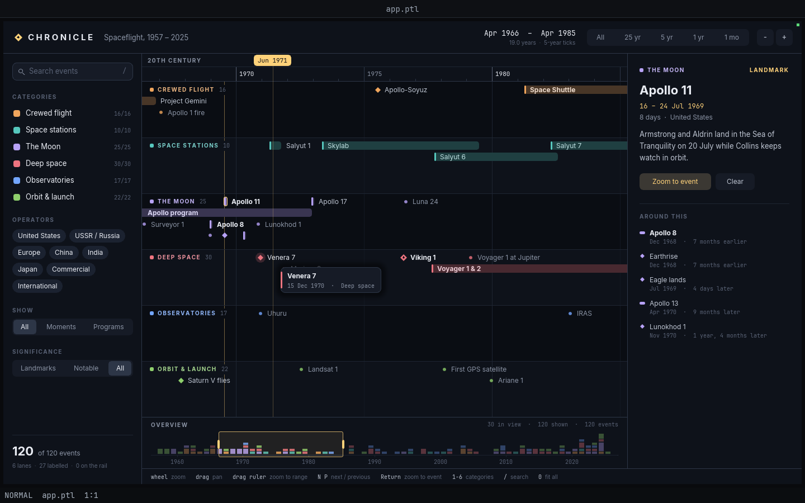

# 46 — Timeline explorer (Chronicle)

A Garden panel app: 120 events from sixty-eight years of spaceflight on one
zoomable time axis. Six category lanes hold point events and long-running
programs; a calendar-aware ruler re-ticks itself from decades down to single
days as you zoom; filters re-pack the lanes as they change; an overview strip
shows the whole span with the current view as a draggable window; and an
inspector describes the selected event and what happened around it.



## Run it

The quickest way is `tools/run-example.ts timeline-explorer` from the repo root (it finds the `garden`
binary and sets the viewport; extra arguments are passed through, e.g.
`tools/run-example.ts timeline-explorer --headless --debug-port 0`). By hand:

```bash
cd examples/dashboards/timeline-explorer
GARDEN_HEADLESS_SIZE=1440x900 \
  ../../../garden/target/debug/garden \
      --headless --debug-port 0 --init layout.ptl > log.txt 2>&1 &
PORT=$(grep -o '127.0.0.1:[0-9]*' log.txt | cut -d: -f2)
curl -s 127.0.0.1:$PORT/screenshot -o shot.png
```

Designed for a **1440×900** viewport, which gives the panel a 1428×828 pane.
The filter rail (248 px) and the inspector (312 px) are fixed; the timeline
takes the rest, and the lanes share whatever height the ruler and the overview
leave, so other sizes reflow (checked at 1280×850; much narrower than that
and the header's range readout runs out of room).

Nothing is saved; every launch starts on the full span with every filter open.

The view eases toward its target after a zoom or a jump, and the panel asks
for frames (`request_frame()`) only while something is moving. Garden puts an
idle panel to sleep after 10 s; a still timeline is the app at rest, not a
hang. A headless test should `POST /tick {"n":60,"dt":0.016}` after an input
to let the easing finish before it takes a screenshot (the `obs_*` values
describe the *target* view, so they are right immediately). A zoom settles in
about 40 such frames; once `obs_animating` is false the screenshot is
byte-identical from run to run. Frames captured mid-ease are not, because the
frame an injected event runs on uses wall-clock `dt()`.

Check the script with `petal check --strict --host garden app.ptl`. Without
`--host garden` the checker does not know `request_frame` and reports it as
an unknown function.

## Reading it

- **Marks.** A diamond is a moment, a bar is a program with a start and an
  end. A hollow diamond and bold type is a landmark, a solid diamond is
  notable, a small dot is a detail. A bar that fades out at the dashed line is
  still running: the data stops in mid-2025.
- **Labels are earned.** Each lane is packed fresh every frame, landmarks
  first. An event that has no room for its label keeps its mark; one that has
  no room for its mark drops to the thin *rail* along the bottom of its lane.
  Zooming in gives the labels back. The sidebar's footer counts both.
- **The ruler** has two tiers: tick labels below, and the next unit up as a
  sticky band above (centuries over decades, decades over years, years over
  months, months over days).
- **The overview** is a per-year histogram, stacked by category, of what the
  filters let through, drawn over a grey ghost of everything.

## Controls

**Timeline**

| Input | Effect |
|---|---|
| wheel | zoom about the pointer (wheel up zooms in) |
| `Shift` + wheel, or a sideways wheel | pan |
| drag in the lanes | pan |
| drag along the ruler | select a range and zoom to it on release |
| click an event | select it; click empty space to clear |
| double-click an event | select it and frame it |
| double-click empty space | zoom in 2.5× at that point |
| hover | a date flag on the ruler; a tooltip over an event |
| `escape` during any drag | cancel it: the view goes back to where the drag found it (the overview drags too) |

**Overview strip**

| Input | Effect |
|---|---|
| drag the window | pan |
| click or drag outside the window | centre the view there, then pan |
| drag a window handle | move that edge (shown once the window is 16 px wide) |

**Keys** (ignored while the search field has focus)

| Key | Effect |
|---|---|
| `left` / `right` | pan 15% of the view (`Shift`: 50%) |
| `up` / `down`, `+` / `-` | zoom in / out 2×, about the pointer if it is over the timeline |
| `home` / `end` | jump to the start / end of the span |
| `0` or `f` | fit the whole span |
| `n` / `p` (or `j` / `k`) | select the next / previous event that passes the filters, panning to reveal it |
| `return` | frame the selected event |
| `1` … `6` | toggle a category |
| `a` | all categories and operators back on |
| `m` | cycle All → Moments → Programs |
| `d` | cycle Landmarks → Notable → All |
| `/` | focus the search field |
| `escape` | cancel a drag in progress; else leave the search field; then clear the selection; then clear the search |
| `r` | reset the filters, the selection and the view |

**Chrome**

| Control | Effect |
|---|---|
| search field | filters on title, description, operator, category and start year as you type; `return` selects the first match |
| category row | toggle the lane; **only** (appears on hover) solos it |
| operator chip | toggle that operator |
| Show / Significance | the same filters as `m` and `d` |
| Reset | appears when the filters hide anything |
| All · 25 yr · 5 yr · 1 yr · 1 mo | set the span of the view, keeping its centre (or the selected event) in place |
| − / + | zoom out / in about the centre |
| inspector rows | select that event and pan to it |
| Zoom to event / Clear | frame the selection / drop it |

## What it exercises

**Zooming time axis.** Time is a float day number, so the same code handles a
71-year view and a 10-day one (a 2,600× zoom range). The ruler picks the
finest of seven tick levels — decade, 5-year, year, quarter, month, week, day —
whose labels still fit, generates ticks on real calendar boundaries
(`day_of` / `civil` do proleptic-Gregorian arithmetic in integer division, and
are asserted against known dates at startup), and draws the level below as
unlabelled minor ticks. Zoom is anchored: the time under the pointer stays
under the pointer through the whole eased transition, because the shown span
is interpolated in log space and the origin is re-derived from the anchor
every frame.

**Events.** A `class Ev` for point and span events, sorted once and held in
`state`. Lane packing is pixel-space interval scheduling with three fallbacks
(label, bare mark, steal a less important neighbour's label, rail), a label
flip against the right edge, a sticky in-bar label for a program that starts
off-screen, and eased row changes so a re-pack glides instead of popping.

**Filtering.** Five independent filters (category, operator, kind,
significance, free text) feed one `passes` predicate; lanes with nothing left
shrink to a title strip and switched-off lanes give their room away; counts
update in the rail, the lane titles, the overview and the inspector.

**Language.** `class` and constructor helpers for seed data, `state` for
everything that persists across frames, `let` rebinding of nested lists
(`rows[r][j] = …`, `out[k].mode = 0`) inside the packer, collecting `for`
loops as list builders, `sort` with a comparator, closures over data
(`filter(range(…), fn(i) -> evs[i].cat == c)`), `while` for the calendar
walks, early `return`, `continue` in nested loops, string building with `++`.

**Host and prelude.** `text_field_update` with a hand-drawn field, the focus
registry, `clip_push` / `clip_pop` nested per lane, `draw_rect_gradient` for
the fading bar ends, `draw_shadow`, `fill_poly`, rounded outlines, `mix` for
opaque tints, `wrap_px` and `ellipsize` in the inspector, `approach` for all
easing, `click_count()`, `scroll_x()` / `scroll_y()` with modifiers,
`request_frame()`.

**Debug-server values** (`panes[0].panel.values`, all prefixed `obs_`):

| Value | Meaning |
|---|---|
| `obs_from`, `obs_to` | ISO dates of the target view's first and last day |
| `obs_span_days` | width of the target view in days |
| `obs_level` | tick level name: `decade`, `5-year`, `year`, `quarter`, `month`, `week`, `day` |
| `obs_events`, `obs_shown`, `obs_in_view` | total, passing the filters, and passing and inside the view |
| `obs_labelled`, `obs_on_rail` | how the packer placed what is on screen |
| `obs_cats`, `obs_orgs` | filter bits as strings, e.g. `"101111"` |
| `obs_kind`, `obs_detail`, `obs_query`, `obs_typing` | the other filters, and whether the search field has focus |
| `obs_lanes` | categories switched on |
| `obs_sel`, `obs_sel_title`, `obs_sel_when` | the selection (index is `-1` for none) |
| `obs_hover`, `obs_hover_title`, `obs_cursor` | what is under the pointer, and the pointer's date |
| `obs_drag` | `""`, `pan`, `band`, `ov-move`, `ov-l`, `ov-r` |
| `obs_animating` | true while the view, a lane or a row is still easing |
| `obs_zooms`, `obs_pans`, `obs_band_zooms`, `obs_selects` | counted edges |

For example, from a reset: `POST /mouse {"op":"scroll","x":431,"y":338,"lines":-9}`
gives `obs_level == "year"` and `obs_zooms == 1`; `key 2` gives
`obs_cats == "101111"` and `obs_shown == 110`; `/` then typing `mars` gives
`obs_shown == 10`.

## Known limits

- **Day precision, and no time zones.** Dates are the calendar dates the
  events are usually cited by, which mixes UTC and local dates (Explorer 1 is
  31 January here, the date at the Cape). The tightest zoom is ten days.
- **The data stops in mid-2025**, and the span is fixed at 1956–2027.
- **Row assignment is not stable under zoom.** Packing is done in pixel space
  each frame, so an event can change rows as its neighbours' labels come and
  go. The move is eased, but it is a move.
- **Marks on the rail are hard to hit**: the hit band there is ±5 px. Zoom in.
- **A flag on the ruler hides the context label under it.** The pointer's date
  flag and the selection's flag share the context band's row; a decade or
  month name that would sit under one (or within 6 px of it) is dropped for
  as long as the flag is there.
- **A long program crossing the left edge cannot use the top row**, because
  each lane's title is reserved there like a label.
- **`/screenshot` does not wait for `request_frame()` animation.** A capture
  taken straight after a zoom shows rows mid-glide; tick first.
- **A `let` bound to a collecting `for` is missing from `panel.values`** on
  the checked-in Garden binary (built from `82aee56`): `vis` and `bin_all`
  never appear there, while lists built by `append` (`ticks`, `placed`) do.
  The observables are scalars and strings for this reason.
- **Builtins are called positionally** because that binary is behind the
  checkout; named arguments are used only for the script's own functions.
- **Wheel direction is by sign** (`scroll_y() < 0` zooms in). Whether that is
  the comfortable way round on a trackpad with natural scrolling was not
  checked in a window.
- **The frame costs about 13 ms at full span** on the debug build (120 events,
  six lanes re-packed and every text run re-measured each frame), and about
  7 ms zoomed in. A few thousand events would need the packer to cull by time
  with a binary search rather than a scan.
- Text cannot be rotated, so there are no slanted tick labels; the ruler
  drops labels that would collide instead.
