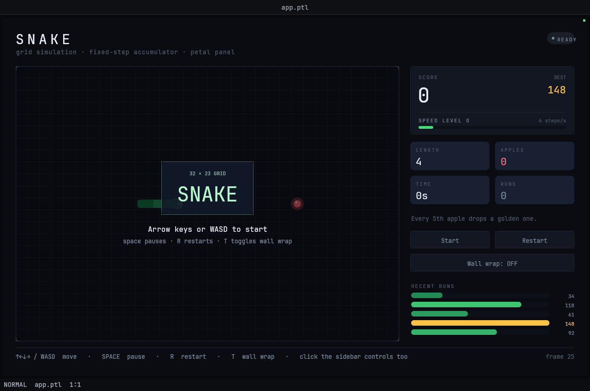

# 03 — Snake

A complete Snake game drawn entirely by a Petal panel script: a 32 × 23 cell
board on a fixed-step simulation clock, keyboard *and* mouse control, and a
sidebar of live telemetry (score, best, speed level, length, apples, elapsed
time, and a bar chart of recent runs).



## Viewport

Designed for the default headless viewport, **1280 × 850**, which gives the
panel pane 1268 × 778 logical pixels after Garden's tab bar and status line.
The layout is computed from `screen_width()`/`screen_height()` — the sidebar
absorbs the slack — but the board is a fixed 832 × 598 px, so much below
1150 × 760 will start to crowd it.

## Run it

The quickest way is `./launch.sh` in this directory (it finds the `garden`
binary and sets the viewport; extra arguments are passed through, e.g.
`./launch.sh --headless --debug-port 0`). By hand:

```bash
cd examples/games/snake
garden --headless --debug-port 0 --init layout.ptl > log.txt 2>&1 &
PORT=$(grep -o '127.0.0.1:[0-9]*' log.txt | cut -d: -f2)
curl -s localhost:$PORT/screenshot -o shot.png
```

(`garden` = `garden/target/debug/garden`.) Windowed works too:
`garden --init layout.ptl`.

## Controls

| Input | Effect |
|---|---|
| `↑ ↓ ← →` or `W A S D` | turn; the first press also starts the game |
| `space` | start / pause / resume (and "play again" after a crash) |
| `R` or `Return` | restart immediately |
| `T` | toggle wall wrap |
| click **Start / Pause / Resume** | same as `space` |
| click **Restart** | same as `R` |
| click **Wall wrap** | same as `T` |

The sidebar buttons light on hover, so the mouse path is discoverable without
reading this table.

### Rules

- Eating an apple grows the snake by two cells and scores `10 + 2 × level`.
- Every fifth apple drops a **golden apple** worth `50 + 10 × level`. It lives
  for seven seconds; a shrinking bar under it and a sidebar ticker count it down.
- Speed level is `apples / 3`, capped at 9 — the step interval runs from
  155 ms down to 56 ms, shown as a meter and a `steps/s` readout.
- With wall wrap **off** the border is a hazard (drawn in the neutral edge
  colour); with it **on** the border turns accent blue and the snake tunnels
  through. Running into yourself is always fatal.
- Finished runs are filed into **RECENT RUNS** (last five, newest at the top);
  the personal best is highlighted in gold.

## Animation note

Garden only ticks a panel for 10 s after the last input, so the snake stops
moving 10 s after you stop touching it and resumes on the next event. That is
Garden's sleep/wake policy, not a bug in the app; when driving it from the
debug server, keep injecting events (a `move` mouse op is enough) to keep the
simulation running.

## What it exercises

**Language:** `state` for the whole game model (snake body as a list of packed
`y * COLS + x` cell indices), `let` dataflow rebinding for per-frame layout,
`var`/`set` only where a real accumulator is needed (`free_cell`'s rejection
sampler, the step counter), top-level `while` driving the fixed-step loop with
`state` writes inside it, list building with `append` inside a captured `for`,
`contains`/`slice` for collision and history, string interpolation in every
label, colour literals plus a `mix` helper for the body gradient, `if`/`elsif`
in expression position, and function overload-free helpers (`cell_x`,
`level_of`, `interval_of`, `opposite`, `seg_color`).

**Host / petal-ui:** `dt()`-driven accumulator (never a fixed per-frame delta),
`time()` for the food pulse and death shake, `key_pressed` for discrete turns,
`hovered`/`clicked` for the sidebar chips, `rect`, `draw_rect_rounded`,
`draw_rect_outline`, `draw_circle`, `draw_line`, styled `draw_text` with
`size`/`color`/`spacing`, `draw_text_center`, `draw_text_right`, `text_width`
for exact pill sizing, and `fit_parts` for the degrading footer hint line.

**Debug server:** every piece of logical state is observable by name in
`/state`'s `panes[0].panel.values` — `phase`, `body`, `score`, `apples`,
`lvl`, `bonus`, `bonus_left`, `wrap`, `pause_label` — so an agent can play the
game (read `body[0]` and `food`, steer, assert the score) without decoding a
single pixel.
