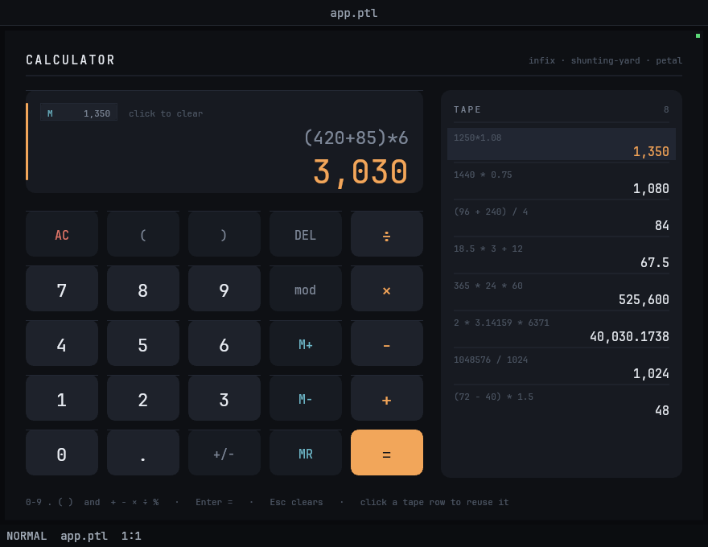

# 13 — Calculator

A full **infix expression calculator** drawn as a Garden panel, in pure Petal.

The keypad and the keyboard both edit one expression string. Every frame that
string is tokenized, converted to RPN by a shunting-yard pass and evaluated, so
the big readout is a *live preview* of the answer while you are still typing it —
including a graceful "trailing operator" mode, where `12 *` still previews `12`
in dim type instead of shouting an error. Committed results land on a scrolling
tape you can click to reuse.



## Viewport

Designed for **880 × 680** (`GARDEN_HEADLESS_SIZE=880x680`). The layout is
computed from `screen_width()`/`screen_height()` every frame, so it survives
other sizes; below roughly 760 × 560 the keys get cramped.

## Run

```bash
cd examples/productivity/calculator
GARDEN_HEADLESS_SIZE=880x680 \
  ../../../garden/target/debug/garden --headless --debug-port 0 --init layout.ptl > log.txt 2>&1 &
PORT=$(grep -o '127.0.0.1:[0-9]*' log.txt | cut -d: -f2)
curl -s localhost:$PORT/screenshot -o shot.png
```

Kill it by PID when done (`kill <pid>`), never `pkill`.

## Controls

**Keyboard**

| Key | Does |
|---|---|
| `0`–`9` `.` `(` `)` | append to the expression |
| `+` `-` `*` `/` `%` | append an operator (a second operator replaces the first) |
| `Enter` / `=` | evaluate, push to the tape |
| `Backspace` / `Delete` | delete the last character |
| `Esc` / `c` | clear |

**Mouse**

- Any keypad key. Hover lights the key; a press draws a fading ring, whether the
  key was clicked or struck on the keyboard.
- `AC` clear · `DEL` backspace · `+/−` toggles the sign of the number the caret
  is on (or opens `(-` after an operator) · `mod` inserts `%`, which is a true
  modulo, not a percentage.
- `M+` / `M−` add or subtract the current value to the memory store; `MR`
  recalls it into the expression. The **M chip** in the display shows the store
  and clears it when clicked.
- **Tape rows**: click one to append its result to the expression. The wheel
  scrolls the tape when the pointer is over it.

## Behaviour worth noticing

- After `=`, the small line keeps the expression that produced the answer
  (`9*9  =`) and the answer sits below it — the card reads as a statement rather
  than echoing itself. The next **digit** starts a new entry; the next
  **operator** continues from the answer.
- The status rail down the left of the display is amber while the expression
  evaluates, red when it does not, and faint when it is empty.
- Errors are named: `divide by zero`, `unclosed (`, `unbalanced )`,
  `malformed number`, `incomplete`.
- Results are formatted, not dumped: integral values lose their `.0`, fractions
  are rounded to 9 decimals with trailing zeros trimmed, and the display groups
  thousands (the grouped form is never parsed back).
- The panel sleeps 10 s after the last input, as every Garden panel does. Nothing
  here animates on its own except the key-press ring, so that is invisible in
  normal use.

## What it exercises

**Language.** Recursion-free expression parsing (tokenizer → shunting-yard →
RPN evaluator) written entirely in Petal: `while` loops, list-as-stack with
`append`/`slice`, records as tagged tokens, string scanning with
`slice`/`contains`, `state` for everything that persists across frames, and
plain `let` rebinding for the per-frame dataflow. No `var`/`set` was needed.

**Host.** `draw_rect_rounded` / `draw_rect_outline` / `draw_line` / `clip`,
styled `draw_text` with `spacing`, exact `text_width` measurement for
right-alignment and for the readout's size fallback, `hovered`/`clicked`,
`text_input()` plus named-key `key_pressed`, `scroll_update`, `ellipsize` /
`ellipsize_tail` / `fit_parts`, and `dt()`-driven decay for the press ring.

**Debug server.** Every piece of logical state is observable in
`/state → panes[0].panel.values`: `expr`, `live` (the evaluator's
`{ok, v, err}`), `ans`, `src_line`, `memory`, `mem_set`, `tape`, `tape_scroll`,
`presses`. The whole app can be driven and asserted without decoding a pixel.

## Known host issue

Garden's headless offscreen renderer mis-rasterizes a glyph the first time it is
needed **after** the initial offscreen render, when a frame mixes many distinct
font sizes: the glyph comes back at some other size's raster while keeping the
correct advance, so a number reads as tiny digits spread across a wide gap. Four
distinct sizes are safe; eight are not. This app therefore uses a strict
four-step type scale (11 / 15 / 22 / 40), which also happens to be better
typography. See the debrief for a minimal reproduction.
